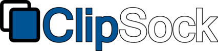
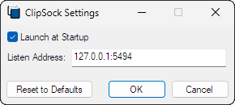

[][1]
[][2]
[][3]

ClipSock is a network accessible clipboard for Windows 10 and 11. It provides
functionality similar to the Windows [cloud-based clipboard][4] for non-Windows
systems. Unlike the cloud-based clipboard, it does not require a Microsoft
account and clipboard contents are not shared with remote hosts.

ClipSock is written in modern C++ with no external dependencies. It uses the
same protocol as [GNU Netcat][5] / [Socat][6], making it ideal for receiving
clipboard data over remote SSH tunnels.

## Installation

Windows Installer packages can be downloaded from the [Releases][2] page or
installed using the [Windows Package Manager][7]:
```
winget install ClipSock.ClipSock
```

> [!IMPORTANT]
> The latest version of the [Visual C++ Redistributable][8] package for Visual
> Studio 2019 must be installed, otherwise an error indicating MSVCP140.dll can
> not be found will occur. This step is not required when using the Windows
> Package Manager as it will install this package automatically.

CMake workflow presets are available to build installer packages from source
using Visual Studio 2019. Install the prerequisites documented in
[Making Changes][9], then issue:
```
cmake --workflow --preset Release-MSVC-x64 ; or Release-MSVC-x86
```

> [!NOTE]
> Once built, installer packages can be found in the build directory.

## Configuration

ClipSock is designed to function with minimal user input. After installation,
the settings dialog will be shown to confirm the defaults, which should be
acceptable for most users:



Once confirmed, the settings dialog may be revisited by right clicking the
taskbar notification area icon and selecting Settings from the context menu. The
server will automatically restart once the dialog closes.

> [!IMPORTANT]
> It is strongly advised to listen to localhost and use remote tunneling to
> protect the privacy of clipboard data transmitted between hosts.

Additional configuration for popular SSH clients and terminal multiplexers can
be found on the [Wiki][10].

## Contributing

Pull requests are welcome! See [CONTRIBUTING.md][11] for details.

## License

Source code in this repository is licensed under a Simplified BSD License. See
[LICENSE.txt][3] for details.

[1]: https://github.com/sstallion/ClipSock/actions/workflows/ci.yml
[2]: https://github.com/sstallion/ClipSock/releases/latest
[3]: https://github.com/sstallion/ClipSock/blob/master/LICENSE.txt
[4]: https://support.microsoft.com/en-us/windows/clipboard-in-windows-c436501e-985d-1c8d-97ea-fe46ddf338c6
[5]: https://netcat.sourceforge.net/
[6]: http://www.dest-unreach.org/socat/
[7]: https://learn.microsoft.com/en-us/windows/package-manager/
[8]: https://learn.microsoft.com/en-us/cpp/windows/latest-supported-vc-redist?view=msvc-170#visual-studio-2015-2017-2019-and-2022
[9]: https://github.com/sstallion/ClipSock/blob/master/CONTRIBUTING.md#making-changes
[10]: https://github.com/sstallion/ClipSock/wiki/Configuration
[11]: https://github.com/sstallion/ClipSock/blob/master/CONTRIBUTING.md
