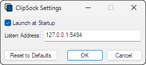

[][1]
[][2]
[][3]

ClipSock is a network accessible clipboard for Windows 10 and 11. It provides
functionality similar to the Windows [cloud-based clipboard][4] for non-Windows
systems. Unlike the cloud-based clipboard, it does not require a Microsoft
account and clipboard contents are not shared with remote hosts.

ClipSock is written in modern C++ with no external dependencies. It uses the
same protocol as [GNU Netcat][5] / [Socat][6], making it ideal for receiving
clipboard data over remote SSH tunnels.

## Installation

Pre-built Windows Installer packages are provided for each [Release][2].

CMake workflow presets are available to build installer packages from source
using Visual Studio 2019. Install the prerequisites documented in [Making
Changes][7], then issue:
```
cmake --workflow --preset Release-MSVC-x64 ; or Release-MSVC-x86
```

> **Note**: Once built, installer packages can be found in the build directory.

## Configuration

ClipSock is designed to function with minimal user input. After installation,
the settings dialog will be shown to confirm the defaults, which should be
acceptable for most users:



Once confirmed, the settings dialog may be revisited by right clicking the
taskbar notification area icon and selecting Settings from the context menu. The
server will automatically restart once the dialog closes.

> **Note**: It is strongly advised to listen to localhost and use remote
> tunneling to protect the privacy of clipboard data transmitted between hosts.

### OpenSSH for Windows

To configure the [Windows OpenSSH][8] client, a Host entry should be added to
`%USERPROFILE%\.ssh\config` with a RemoteForward declaration to forward packets
from port 5494 on the remote host to ClipSock over the secure channel:
```
Host host.example.com
    RemoteForward 127.0.0.1:5494 127.0.0.1:5494
```

SSH into the remote host and create a shell alias to read from standard input
using either GNU Netcat or Socat:
```
$ alias clip="nc -N 127.0.0.1 5494"       # GNU Netcat
$ alias clip="socat - TCP:127.0.0.1:5494" # Socat
```

> **Note**: The above assumes a Bourne-style shell. See vendor documentation on
> how to create an alias if using a different shell.

To verify ClipSock is working over the secure channel, issue:
```
$ echo -n "Hello, World!" | clip
```

Finally, press the **Windows logo key + V** to view your clipboard history,
which should now contain the phrase `Hello, World!`:


Configuration for other SSH clients and terminal multiplexers can be found on
the [Wiki][9].

## Contributing

Pull requests are welcome! See [CONTRIBUTING.md][10] for details.

## License

Source code in this repository is licensed under a Simplified BSD License. See
[LICENSE.txt][3] for details.

[1]: https://github.com/sstallion/ClipSock/actions/workflows/ci.yml
[2]: https://github.com/sstallion/ClipSock/releases/latest
[3]: https://github.com/sstallion/ClipSock/blob/master/LICENSE.txt
[4]: https://support.microsoft.com/en-us/windows/clipboard-in-windows-c436501e-985d-1c8d-97ea-fe46ddf338c6
[5]: https://netcat.sourceforge.net/
[6]: http://www.dest-unreach.org/socat/
[7]: https://github.com/sstallion/ClipSock/blob/master/CONTRIBUTING.md#making-changes
[8]: https://learn.microsoft.com/en-us/windows-server/administration/openssh/openssh_overview
[9]: https://github.com/sstallion/ClipSock/wiki/Configuration
[10]: https://github.com/sstallion/ClipSock/blob/master/CONTRIBUTING.md
